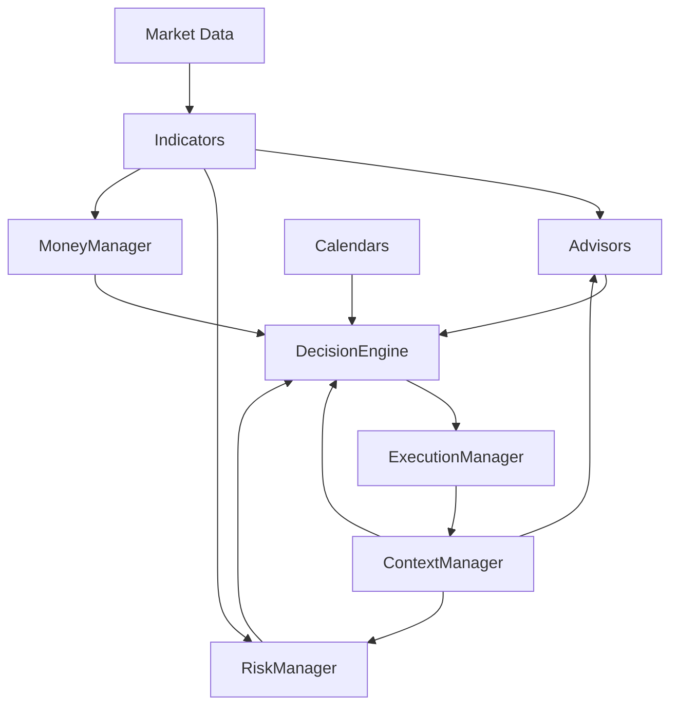

# 🧐 Архитектура алгоритмической торговой стратегии

## 🔹 Общая концепция

Архитектура построена по принципам **модульности**, **слабой связанности** и **централизованного принятия решений**. Все модули взаимодействуют через общий контекст, управляемый `ContextManager`. Ключевую роль в оценке и интерпретации информации играет компонент `DecisionEngine`, получающий входные данные от всех вспомогательных компонентов и вырабатывающий торговые действия.

---

## ⚙️ Компоненты архитектуры

### 1. **Indicators**

Реализуют расчёт технических и статистических индикаторов на основе рыночных данных:

* Обновляются на каждом баре или тике.
* Работают с OHLCV, стаканом, объёмами и производными.
* Результаты доступны `Advisors`, `RiskManager`, `MoneyManager` и `ContextManager`.

### 2. **Advisors**

Формируют сигналы на основе результатов `Indicators`, `Calendars`, `ContextManager` и бизнес-логики:

* Сигналы могут быть на вход, выход, удержание позиции.
* Не принимают решений — только вырабатывают гипотезы.

### 3. **RiskManager**

Оценивает риски и задаёт торговые ограничения:

* Уровни `SL/TP`, условия досрочного выхода.
* Условия пропуска сделки, допустимые отклонения цены.
* Работает на основании `Indicators`, `ContextManager`, позиции и рыночной ситуации.

### 4. **MoneyManager**

Рассчитывает объём торговой позиции:

* На базе капитала, плеча, волатильности.
* Учитывает рекомендации `RiskManager` и фазу стратегии.

### 5. **Calendars**

Определяют допустимость торговой активности по времени:

* Учитывают расписания торговых сессий, события, таймфреймы.
* Выдают разрешение или запрет на торговлю.

### 6. **DecisionEngine**

Центральный блок принятия решений:

* Получает данные от `Advisors`, `RiskManager`, `MoneyManager`, `Calendars`, `ContextManager`.
* Производит валидацию сигналов (pre-checks) с указанием причин отказа.
* Формирует торговые инструкции: Entry, Exit, Hold, Skip.
* Обеспечивает логирование всех этапов принятия решений.

### 7. **ExecutionManager**

Исполняет торговые инструкции:

* Трансформирует их в ордера (`market`, `limit`, `stop`).
* Сопровождает позицию, обновляет контекст по результатам исполнения.

### 8. **ContextManager**

Централизованное хранилище состояния стратегии:

* **Short-Term** — обновляется на каждом баре, содержит временные сигналы и метрики.
* **Long-Term** — изменяется только при необходимости, хранит фазы, режимы, даты входа, счётчики.
* Доступен для чтения и записи всем ключевым компонентам.

---

## 🔄 Поток данных и взаимодействие компонентов



---

## 📊 Контроль целостности и отказ от фильтров

Компонент `DecisionEngine` выполняет все необходимые проверки (pre-checks) и объясняет причины отказа от сигналов, если они отклонены:

Пример валидации:

```python
if signal.strength < min_threshold:
    return Skip(reason="Weak signal")
if not calendar.allows_trade():
    return Skip(reason="Calendar restriction")
```

Такой подход обеспечивает **трассируемость**, **объяснимость решений** и **отказ от внешних фильтров**, которые могли бы исказить входные сигналы до обработки в `DecisionEngine`.

---

## 🔄 Расширяемость

* Все компоненты можно добавлять и модифицировать независимо.
* `DecisionEngine` поддерживает шаблоны поведения (rule-based, сценарные, ML-модели).
* Архитектура поддерживает песочницу, симуляции и живую торговлю без изменений логики компонентов.

---

## 📄 Возможности для будущего развития

* Визуализация пайплайна решений (Decision Tracing).
* Интерфейс управления сценариями через YAML/DSL.
* Расширение `ContextManager` для многосимвольной работы.
* Поддержка событийной шины (event bus) между модулями.

---